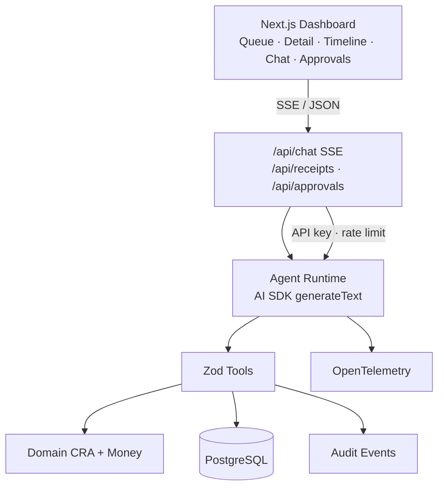

# Architecture Diagram

```mermaid
flowchart TB
  UI[Next.js Dashboard<br/>Queue · Detail · Timeline · Chat · Approvals]
  API["/api/chat SSE<br/>/api/receipts · /api/approvals"]
  Agent[Agent Runtime<br/>AI SDK generateText]
  Tools[Zod Tools]
  Domain[Domain CRA + Money]
  DB[(PostgreSQL)]
  Audit[Audit Events]
  OTEL[OpenTelemetry]

  UI -->|SSE / JSON| API
  API --> Agent
  Agent --> Tools
  Tools --> Domain
  Tools --> DB
  Tools --> Audit
  Agent --> OTEL
  API -->|API key · rate limit| Agent
```
